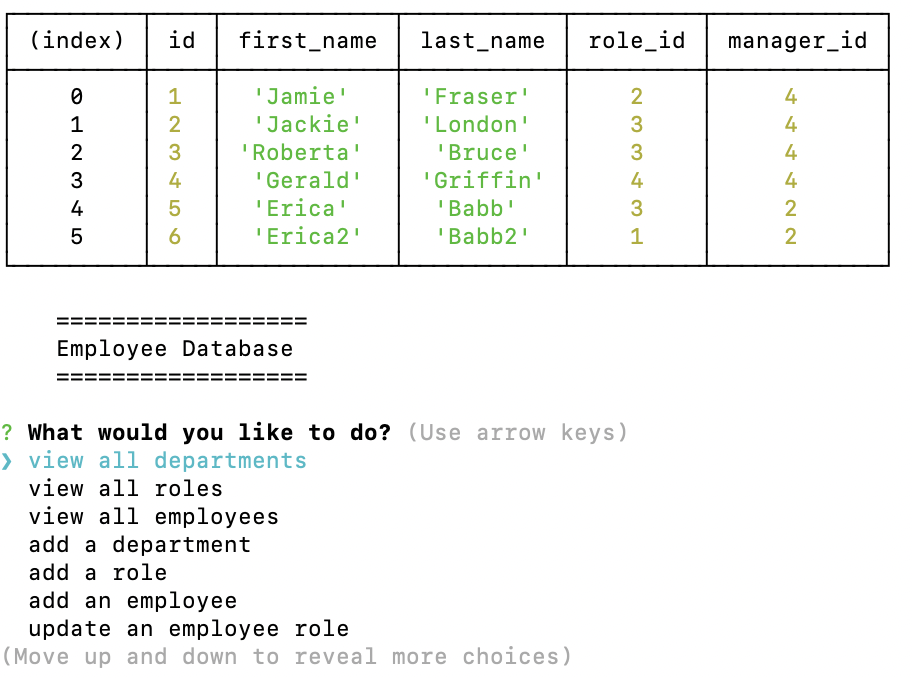

# Employee Database

## Description

This application is best suited for users wanting to stay organized and easily manage their employee database. This is accomplished through the inquirer prompt. Users have the option to create and view all departments, roles, and employees. They can also update an employee's role.

Made with:

- mysql2
- JS
- Inquirer.js
- node modules

## Table of Contents

- [Installation](#installation)
- [Usage](#usage)
- [License](#license)
- [Questions](#questions)

## Installation

Clone the repo and ensure the the npm packages--inquirer and mysql2--are downloaded. Type "npm start" in your terminal to begin!

## Usage

## License

## Questions

Github: EricaBabb
Email: ecamilebabb@gmail.com
